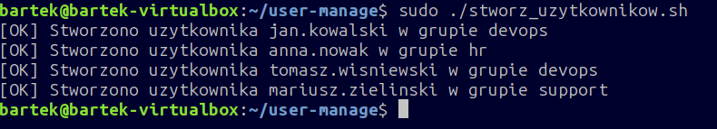
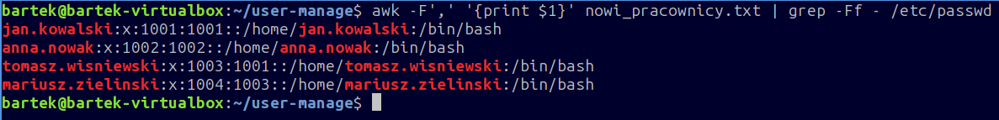

# Linux User Automation Script

Skrypt powłoki Bash przeznaczony dla administratorów systemu Linux, automatyzujący proces masowego zakładania kont użytkowników na podstawie zewnętrznego pliku tekstowego. Program weryfikuje uprawnienia roota, dynamicznie tworzy wymagane grupy systemowe (działy), zakłada katalogi domowe, konfiguruje domyślną powłokę oraz nadaje startowe hasła dostępowe.

## Podgląd działania programu

